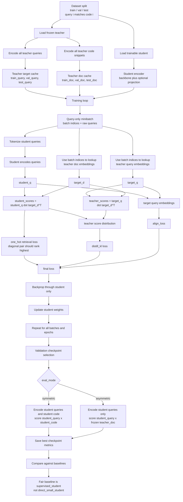

# EmbedDistill Mermaid Diagram

This is the repo-specific `embed_distill` flow.

- Local method: `embed_distill`
- Paper inspiration: `EmbedDistill: A Geometric Knowledge Distillation for Information Retrieval`
- Important repo detail: this suite uses a lightweight MBPP/TACO mapping, not a full paper reproduction

## End-to-End `embed_distill` Flow

## How To Read It

- The teacher is only a source of frozen targets.
- The student is the only model updated by gradient descent.
- During `embed_distill` training, the student usually encodes only queries for the minibatch.
- The training loss is:
  - dataset retrieval loss on `student_scores`
  - plus KL to teacher score distributions
  - plus direct query embedding alignment
- Fair reporting should compare `embed_distill` to `supervised_student`, because both are trained students.

## Code Pointers

- Teacher freeze and precompute: [`src/mbpp_kd_suite/experiment.py`](../src/mbpp_kd_suite/experiment.py)
- Student model and projection: [`src/mbpp_kd_suite/modeling.py`](../src/mbpp_kd_suite/modeling.py) and [`src/mbpp_kd_suite/training.py`](../src/mbpp_kd_suite/training.py)
- KD query-only training path: [`src/mbpp_kd_suite/training.py`](../src/mbpp_kd_suite/training.py)
- `embed_distill` loss branch: [`src/mbpp_kd_suite/training.py`](../src/mbpp_kd_suite/training.py)
- Symmetric vs asymmetric evaluation: [`src/mbpp_kd_suite/metrics.py`](../src/mbpp_kd_suite/metrics.py)
