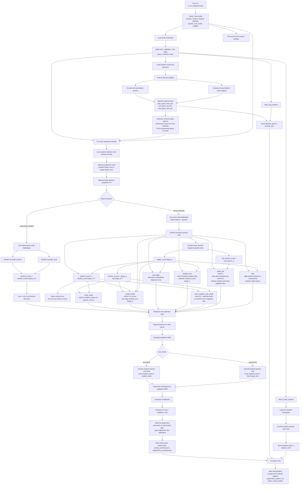
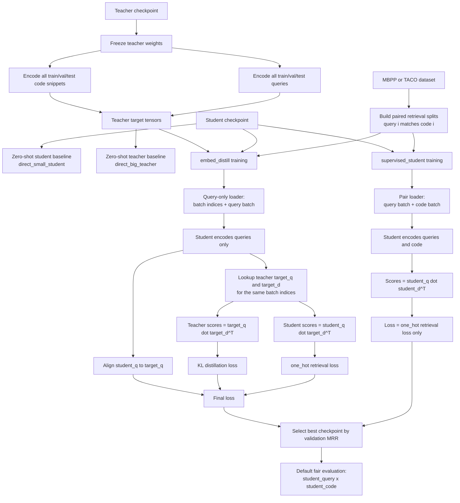
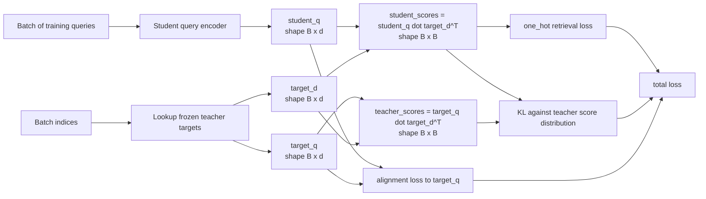
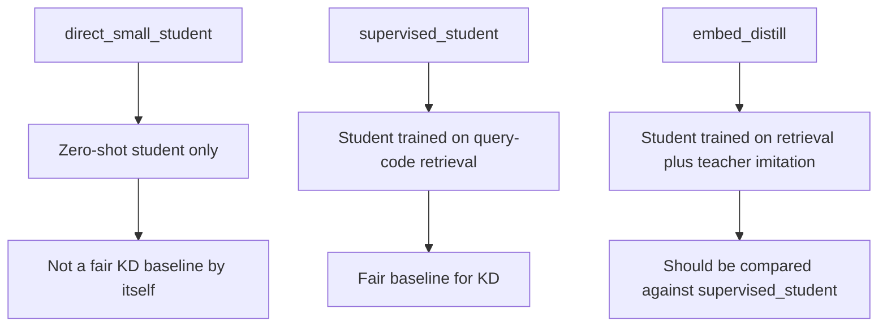

# Student-Teacher Mermaid Notes

This note explains the current comparison you have been running most often:

- `supervised_student`: normal student finetuning, no KD
- `embed_distill`: student trained with dataset retrieval loss plus teacher imitation

Paper mapping:

- `embed_distill` is the local approximation of `EmbedDistill: A Geometric Knowledge Distillation for Information Retrieval`
- `supervised_student` is not from a paper; it is the fair no-KD baseline

## Full End-to-End Chart

## High-Level Run Flow

## What `embed_distill` Actually Optimizes

## The Key Comparison

## Read This Alongside The Code

- Teacher is frozen and precomputed in [`src/mbpp_kd_suite/experiment.py`](../src/mbpp_kd_suite/experiment.py).
- Student model and optional projection live in [`src/mbpp_kd_suite/modeling.py`](../src/mbpp_kd_suite/modeling.py) and [`src/mbpp_kd_suite/training.py`](../src/mbpp_kd_suite/training.py).
- `supervised_student` uses paired query-code training in [`src/mbpp_kd_suite/training.py`](../src/mbpp_kd_suite/training.py).
- KD methods use query-only batches and frozen teacher targets in [`src/mbpp_kd_suite/training.py`](../src/mbpp_kd_suite/training.py).
- `embed_distill` specifically adds KL plus query alignment in [`src/mbpp_kd_suite/training.py`](../src/mbpp_kd_suite/training.py).
- The paper mapping is recorded in [PAPER_IMPLEMENTATIONS.md](/Users/samuellee/BME/CS4248/proj_1/CS4248_ez_A/mbpp_kd_suite/docs/PAPER_IMPLEMENTATIONS.md#L7).
