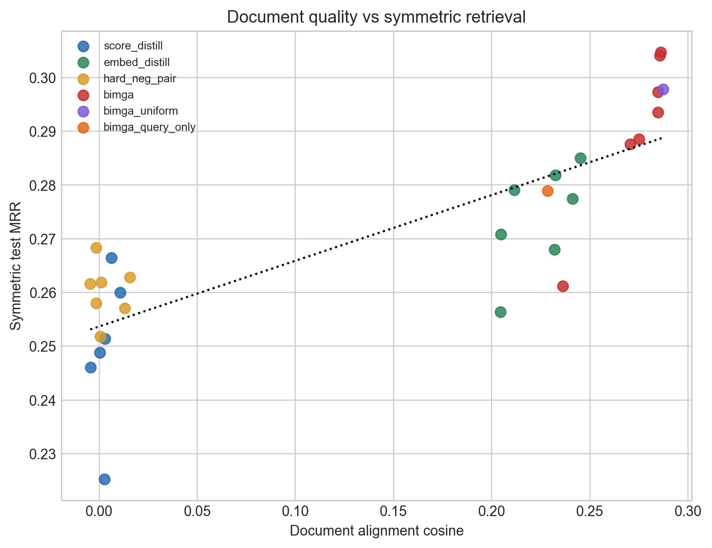
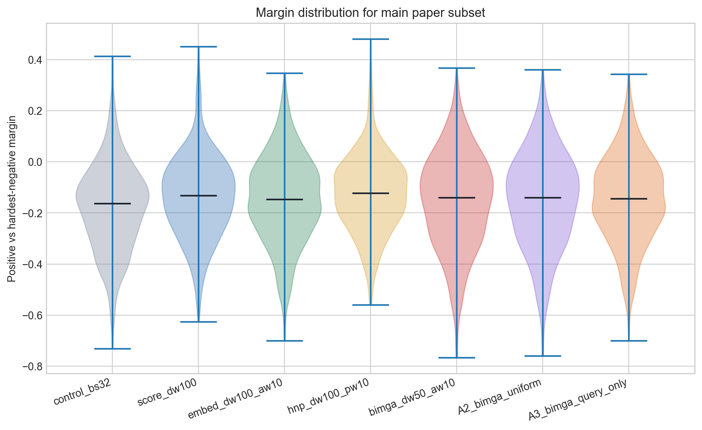
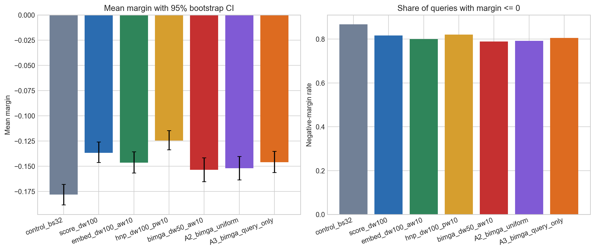
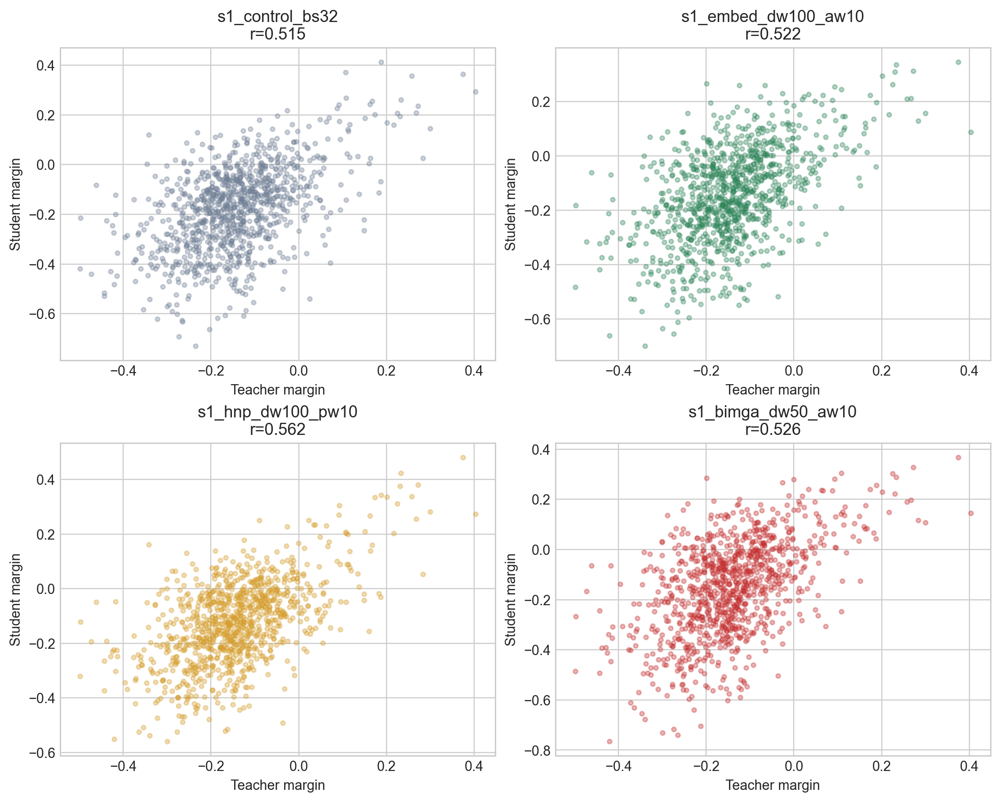
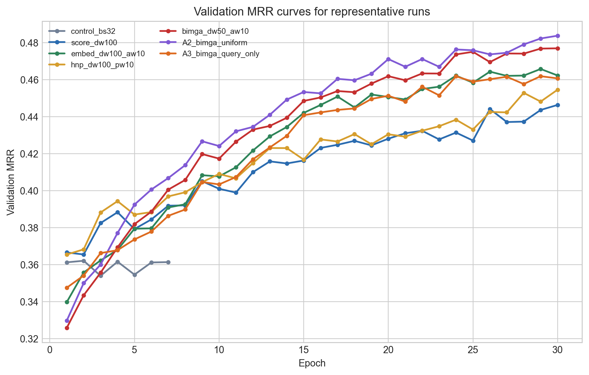

# TACO HF Quantitative Findings

This report summarizes the replay-based quantitative analysis for the `submission/experiments` TACO sweep. All numbers in this report come from the HF-replayed checkpoints in [run_metrics.csv](./csv/run_metrics.csv), [run_diagnostics.csv](./csv/run_diagnostics.csv), [method_summary.csv](./csv/method_summary.csv), and [seed_summary.csv](./csv/seed_summary.csv).

## Scope and protocol

The package replays all 31 uploaded student checkpoints from the `cs4248-nlp` Hugging Face organization on the fixed TACO test split of 1000 queries. The replay uses the same mean-pooling plus optional projection pattern documented in the experiment README. The main reported retrieval metric is symmetric test `MRR`, with `Recall@1`, `Recall@10`, `MAP@10`, and `nDCG@10` also retained in the CSV outputs.

For the two quantitative analyses assigned in the sprint deck, the key definitions are:

- `Document embedding quality`: mean cosine similarity between student document embeddings and teacher document embeddings on the TACO test set.
- `Score separation`: per-query margin defined as `score(query, positive) - max(score(query, hardest negative))` across the full TACO candidate pool.

A useful caution is that the margin statistic is strict. Because it compares each positive against the single hardest negative across the full retrieval pool, the average margin is still negative for every representative method. In this setting the meaningful comparison is which method is `less negative`, and which method reduces the fraction of queries with a negative margin.

## Representative method table

The main paper subset is the same fixed subset used for the figure package.

| Run | Method | Symmetric Test MRR | Recall@1 | Recall@10 | Asymmetric Test MRR | Doc Cosine | Mean Margin | Negative-Margin Rate |
| --- | --- | ---: | ---: | ---: | ---: | ---: | ---: | ---: |
| `s1_control_bs32` | control | 0.1983 | 0.133 | 0.329 | - | - | -0.1782 | 0.867 |
| `s1_score_dw100` | score_distill | 0.2664 | 0.184 | 0.421 | 0.0071 | 0.0062 | -0.1369 | 0.816 |
| `s1_embed_dw100_aw10` | embed_distill | 0.2818 | 0.200 | 0.442 | 0.1428 | 0.2324 | -0.1465 | 0.800 |
| `s1_hnp_dw100_pw10` | hard_neg_pair | 0.2683 | 0.180 | 0.438 | 0.0070 | -0.0015 | -0.1246 | 0.820 |
| `s1_bimga_dw50_aw10` | bimga | 0.2973 | 0.211 | 0.465 | 0.1493 | 0.2845 | -0.1536 | 0.789 |
| `s3_A2_bimga_uniform` | bimga_uniform | 0.2978 | 0.208 | 0.470 | 0.1482 | 0.2873 | -0.1520 | 0.792 |
| `s3_A3_bimga_query_only` | bimga_query_only | 0.2789 | 0.195 | 0.439 | 0.1387 | 0.2283 | -0.1461 | 0.805 |

The main headline from this table is straightforward:

`BiMGA` and `BiMGA-uniform` are the strongest methods on symmetric TACO retrieval, while `control` is clearly weakest. `embed_distill` is the strongest non-BiMGA baseline. `hard_neg_pair` improves the strict hardest-negative margin, but that does not translate into the best retrieval accuracy.

## Analysis #1: document embedding quality

### Main finding

Better document alignment strongly tracks better symmetric retrieval.

Across the replay-compatible runs, the correlation between document cosine and symmetric test MRR is `r = 0.814`. This is the main quantitative result supporting the symmetric-retrieval argument from the sprint deck. The methods that actually align document embeddings to the teacher are also the methods that perform best when the student has to encode both query and code.

The contrast is especially clear in the representative subset:

- `score_distill`: document cosine `0.0062`, symmetric test MRR `0.2664`
- `hard_neg_pair`: document cosine `-0.0015`, symmetric test MRR `0.2683`
- `embed_distill`: document cosine `0.2324`, symmetric test MRR `0.2818`
- `bimga`: document cosine `0.2845`, symmetric test MRR `0.2973`
- `bimga_uniform`: document cosine `0.2873`, symmetric test MRR `0.2978`

This is the clearest evidence that query-only KD is not enough for this retrieval setting. The methods that leave document embeddings near the teacher-independent baseline do not reach the same symmetric retrieval quality as the methods with explicit document alignment.

### Symmetric vs asymmetric penalty

The second supporting result is even stronger. The correlation between document cosine and the symmetric-minus-asymmetric MRR gap is `r = -0.960`.

This means that as document alignment improves, the penalty for forcing the student to encode documents itself becomes smaller. That is exactly the expected behavior if the real bottleneck is document representation quality.

The lowest symmetric penalties among the replayed runs come from document-aligned methods:

- `s1_embed_dw50_aw10`: gap `0.1352`, doc cosine `0.2411`
- `s1_embed_dw100_aw10`: gap `0.1390`, doc cosine `0.2324`
- `s1_bimga_dw50_aw1`: gap `0.1396`, doc cosine `0.2361`
- `s3_A3_bimga_query_only`: gap `0.1402`, doc cosine `0.2283`

The highest penalties come from the document-unaligned methods:

- `s1_score_dw100`: gap `0.2593`, doc cosine `0.0062`
- `s1_hnp_dw100_pw10`: gap `0.2614`, doc cosine `-0.0015`

So Analysis #1 supports the BiMGA motivation directly: document alignment is not a cosmetic diagnostic. It is one of the strongest predictors of symmetric retrieval quality in this experiment set.

## Analysis #2: score separation

### Main finding

Score separation is informative, but it does not fully explain the method ranking by itself.

Under the strict hardest-negative margin definition, `hard_neg_pair` produces the least negative mean and median margins in the representative subset:

- `hard_neg_pair`: mean margin `-0.1246`, median margin `-0.1223`
- `score_distill`: mean margin `-0.1369`
- `embed_distill`: mean margin `-0.1465`
- `bimga`: mean margin `-0.1536`
- `control`: mean margin `-0.1782`

If the analysis stopped there, it would suggest that `hard_neg_pair` is strongest on score separation. But that would be incomplete. The failure-rate view tells a different story:

- `bimga`: negative-margin rate `0.789`
- `bimga_uniform`: negative-margin rate `0.792`
- `embed_distill`: negative-margin rate `0.800`
- `hard_neg_pair`: negative-margin rate `0.820`
- `control`: negative-margin rate `0.867`

So the score-separation story is split into two parts:

1. `hard_neg_pair` improves the average hardest-negative margin more aggressively.
2. `bimga` reduces the overall rate of outright hardest-negative failures more effectively, and still achieves the best symmetric retrieval quality.

This is why score separation is a useful secondary analysis rather than a complete explanation on its own. Margin shaping helps, but without document alignment it does not produce the best end-to-end retrieval system.

### Teacher margin tracking

Teacher-student margin tracking also follows this pattern. Among the representative runs, the strongest teacher-margin correlation is:

- `s1_hnp_dw100_pw10`: `r = 0.562`

This supports the idea that hard-negative pairwise training learns something real about local ranking pressure. But again, that does not overcome the missing document-space alignment. `hard_neg_pair` learns a sharper local separation signal, while BiMGA learns a better document geometry for symmetric retrieval.

So Analysis #2 should be written carefully:

- yes, stronger KD methods do change score separation,
- but the best MRR method is not simply the method with the highest average margin,
- which means score separation is only part of the overall explanation.

## Robustness and stability

The representative training curves show that the strong methods are not just winning from a lucky endpoint. Within the representative subset, `s3_A2_bimga_uniform` has the strongest final validation MRR at `0.4838`.

The multi-seed table is also favorable to BiMGA:

- `bimga`: mean test MRR `0.3008 ± 0.0051`, doc cosine `0.2854 ± 0.0007`
- `embed_distill`: mean test MRR `0.2783 ± 0.0074`, doc cosine `0.2365 ± 0.0061`
- `hard_neg_pair`: mean test MRR `0.2628 ± 0.0046`, doc cosine `0.0091 ± 0.0076`
- `score_distill`: mean test MRR `0.2584 ± 0.0073`, doc cosine `0.0057 ± 0.0043`

So the top-line method ranking is not a single-seed accident. BiMGA remains strongest on average across the seed runs, and it does so with very stable document cosine.

## Figure-to-analysis mapping

For the report and presentation, the figures map cleanly as follows.

### Analysis #1: document embedding quality

- [fig02_doc_cosine_vs_sym_mrr.png](./figures/fig02_doc_cosine_vs_sym_mrr.png)
- [fig03_doc_cosine_vs_sym_asym_gap.png](./figures/fig03_doc_cosine_vs_sym_asym_gap.png)
- [fig07_seed_stability.png](./figures/fig07_seed_stability.png)

Use these to support the claim that better document alignment explains stronger symmetric retrieval and smaller symmetric penalties.

### Analysis #2: score separation

- [fig04_margin_distribution_best_methods.png](./figures/fig04_margin_distribution_best_methods.png)
- [fig05_margin_summary_best_methods.png](./figures/fig05_margin_summary_best_methods.png)
- [fig08_teacher_margin_vs_student_margin.png](./figures/fig08_teacher_margin_vs_student_margin.png)

Use these to support the claim that score separation changes meaningfully across KD methods, but does not fully determine the final method ranking.

### Supporting overview figures

- [fig01_core_sweep_mrr.png](./figures/fig01_core_sweep_mrr.png)
- [fig06_training_curves_best_runs.png](./figures/fig06_training_curves_best_runs.png)

Use these to establish the overall method ranking and to show that the stronger methods are stable during training.

## Recommended report wording

If you want a concise paper-style conclusion for this quantitative section, the safest wording is:

> HF replay across all 31 TACO sweep checkpoints shows that document embedding quality is a strong predictor of symmetric retrieval quality. Methods with explicit document alignment, especially BiMGA and BiMGA-uniform, achieve the highest document cosine and the highest symmetric test MRR. Score separation also changes across methods, but it is not sufficient on its own: hard-negative pair distillation improves the strict hardest-negative margin without matching BiMGA on final symmetric retrieval. Together, these results support the claim that bidirectional alignment is the main reason BiMGA is strongest in the symmetric code-search setting.

## Files to review first

If you want the shortest review path, start with:

- [method_summary.csv](./csv/method_summary.csv)
- [seed_summary.csv](./csv/seed_summary.csv)
- [fig02_doc_cosine_vs_sym_mrr.md](./figures_md/fig02_doc_cosine_vs_sym_mrr.md)
- [fig03_doc_cosine_vs_sym_asym_gap.md](./figures_md/fig03_doc_cosine_vs_sym_asym_gap.md)
- [fig04_margin_distribution_best_methods.md](./figures_md/fig04_margin_distribution_best_methods.md)
- [fig05_margin_summary_best_methods.md](./figures_md/fig05_margin_summary_best_methods.md)
