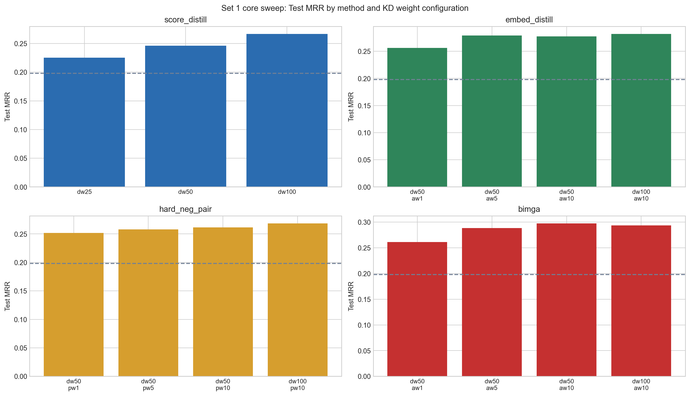

# Figure 1: Core sweep MRR

**Purpose:** Show how each KD family improves or fails to improve over the no-KD control across the Set 1 sweep.

## How to read this
Each subplot is one KD family. The dashed horizontal line is the control baseline. Higher bars mean better test retrieval on TACO.

## What it shows
The strongest Set 1 family is bimga with best test MRR 0.2973, compared with control at 0.1983.

## Why it matters for the paper
This establishes the sweep-level ranking before we argue why the stronger methods win.
