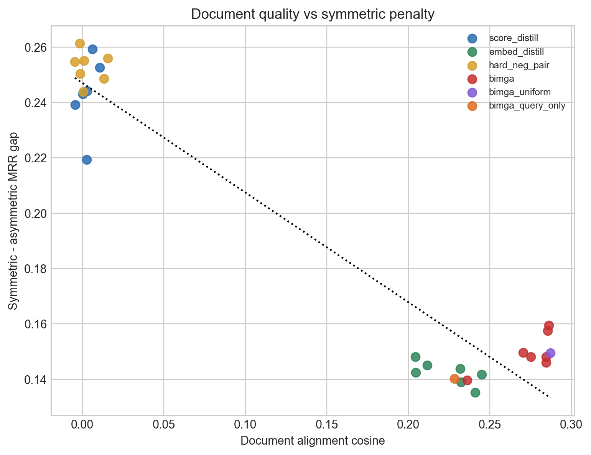

# Figure 3: Document cosine vs symmetric-asymmetric gap

**Purpose:** Test whether better student document embeddings reduce the penalty of symmetric evaluation.

## How to read this
A smaller or near-zero gap means the student loses less when it has to encode documents itself instead of reusing teacher docs.

## What it shows
Across 29 replayed runs, higher document cosine is associated with a smaller symmetric penalty (Pearson r=-0.960).

## Why it matters for the paper
This directly supports the paper claim that document alignment matters in symmetric retrieval.
