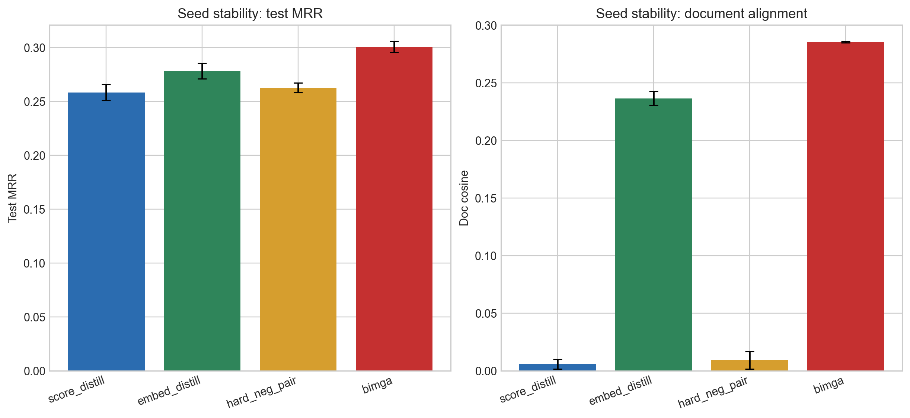

# Figure 7: Seed stability

**Purpose:** Measure whether the main method ranking is stable across seeds.

## How to read this
Each bar shows the mean across seed42/123/456, with standard deviation as the error bar.

## What it shows
The best multi-seed mean test MRR is bimga at 0.3008.

## Why it matters for the paper
A method that only wins once is weak evidence. This figure shows whether the gain survives random initialization.
