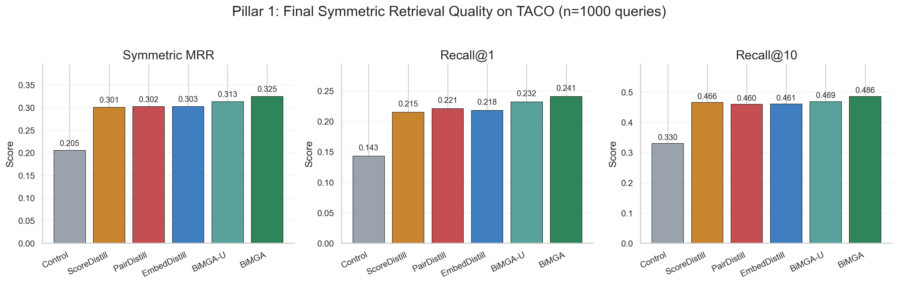
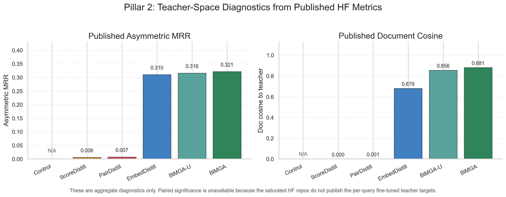
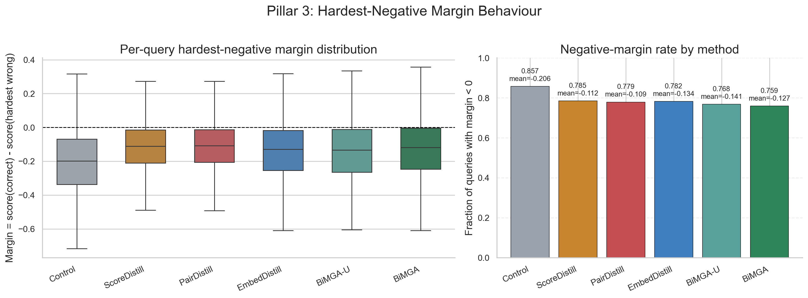
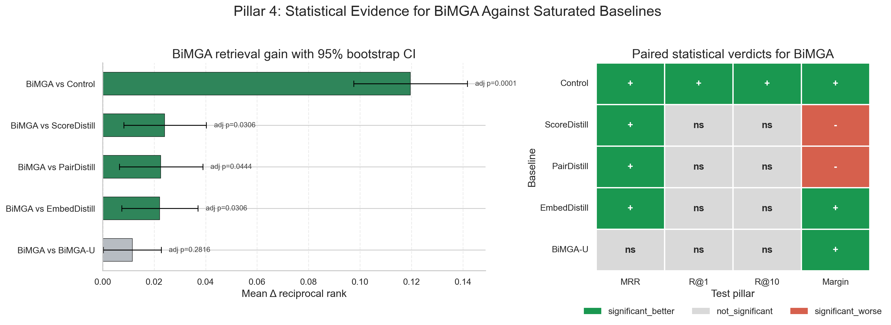
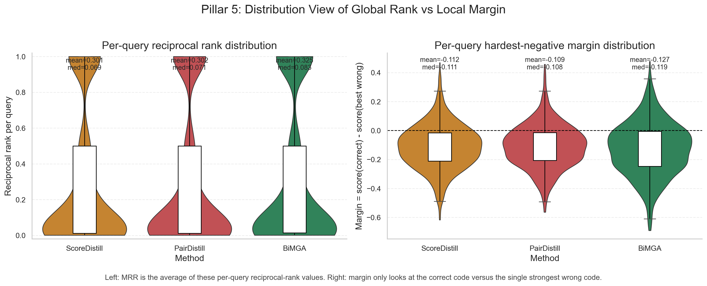
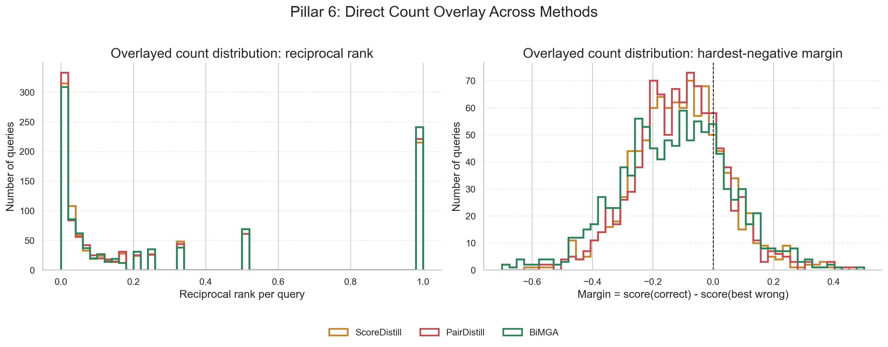

# Poster Statistical Figures

These figures summarize the saturated TACO evaluation for the six final Hugging Face checkpoints. They are poster-oriented views over the exact replay and significance outputs in `/submission/experiments/analysis/significance`.

## Figure 1. Final Symmetric Retrieval Quality

This plot compares the final symmetric retrieval metrics across all six saturated methods. The x-axis is the training method and the y-axis is the metric value. The key message is that BiMGA is the strongest final retriever on all three headline metrics, with BiMGA-uniform as the closest variant.

## Figure 2. Teacher-Space Diagnostics

This plot shows the published aggregate teacher-space diagnostics from each HF repo: asymmetric MRR and document cosine. The x-axis is the method and the y-axis is the diagnostic value. The key message is that alignment-based methods retain strong compatibility with teacher document space, while score-only and pairwise methods do not.

## Figure 3. Hardest-Negative Margin Behaviour

The left panel plots the per-query hardest-negative margin distribution; the y-axis is `score(correct) - score(hardest wrong)` and the x-axis is the method. The right panel shows the fraction of queries with negative margin. The key message is that PairDistill and ScoreDistill sharpen the strict local margin more than BiMGA, but that local gain does not translate into the best overall retrieval.

## Figure 4. Paired Statistical Evidence for BiMGA

The left panel is a forest plot of mean reciprocal-rank deltas for BiMGA against each baseline, with 95% bootstrap confidence intervals and Holm-adjusted permutation-test p-values. The right panel is a compact significance matrix over the paired tests used in the report: reciprocal rank, Recall@1, Recall@10, and hardest-negative margin. The key message is that BiMGA is significantly better than EmbedDistill, PairDistill, ScoreDistill, and Control on reciprocal-rank retrieval, while the BiMGA vs BiMGA-uniform gap is not significant.

## Figure 5. Reciprocal-Rank and Margin Distributions

The left panel shows the per-query reciprocal-rank distribution for `ScoreDistill`, `PairDistill`, and `BiMGA`. Since `MRR` is just the average of reciprocal rank across queries, this is the most direct distribution view behind the final MRR numbers. The right panel shows the per-query hardest-negative margin distribution for the same three methods. The key message is that `ScoreDistill` and `PairDistill` have slightly better local margin distributions, but `BiMGA` still has the strongest reciprocal-rank distribution overall.

## Figure 6. Overlayed Count Distributions

This figure puts the three methods on the same axes. The left panel overlays the reciprocal-rank count distributions, so you can directly see which method has more queries at low or high reciprocal-rank values. The right panel does the same for hardest-negative margin. This is the clearest visual for answering: where exactly does BiMGA have more high-quality ranking outcomes, and where exactly do ScoreDistill and PairDistill have more favorable local margins?

## Files

- Retrieval: `poster_fig01_retrieval_quality.png`, `poster_fig01_retrieval_quality.svg`
- Alignment: `poster_fig02_teacher_space_diagnostics.png`, `poster_fig02_teacher_space_diagnostics.svg`
- Margin: `poster_fig03_margin_behaviour.png`, `poster_fig03_margin_behaviour.svg`
- Significance: `poster_fig04_bimga_significance.png`, `poster_fig04_bimga_significance.svg`
- RR vs margin distributions: `poster_fig05_rr_margin_distributions.png`, `poster_fig05_rr_margin_distributions.svg`
- Overlay counts: `poster_fig06_overlay_counts.png`, `poster_fig06_overlay_counts.svg`
