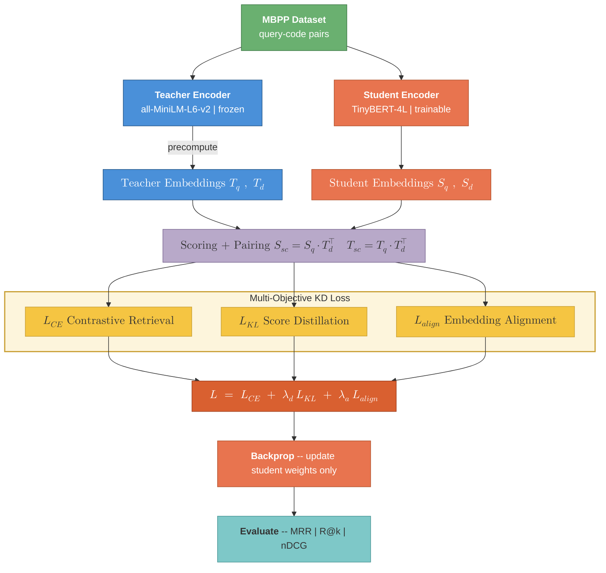

# KD Training Pipeline — Poster Diagram

## Overview

We distill retrieval knowledge from a frozen all-MiniLM-L6-v2 teacher into a TinyBERT-4L student on TACO query-code pairs. Training optimizes a multi-objective loss combining contrastive cross-entropy (L_CE) for hard ranking, KL divergence (L_KL) for soft score alignment, and an embedding alignment term (L_align) that directly minimizes the representational gap between student and teacher. Each KD variant activates a different subset of these objectives: supervised training uses L_CE alone, score distillation adds L_KL, and our proposed BiMGA further introduces bidirectional margin-guided alignment over both query and code embeddings, weighted by the teacher's confidence margin via a sigmoid gate. Only student weights are updated; evaluation uses MRR, Recall@k, and nDCG.

## Method Variants

| Method | Active Losses |
|---|---|
| supervised | $\mathcal{L}_{CE}$ only |
| score_distill | $\mathcal{L}_{CE} + \mathcal{L}_{KL}$ |
| embed_distill | $\mathcal{L}_{CE} + \mathcal{L}_{KL} + \mathcal{L}_{align}$ (query only) |
| **BiMGA** | $\mathcal{L}_{CE} + \mathcal{L}_{KL} + \mathcal{L}_{align}$ (query + code, margin-weighted) |
